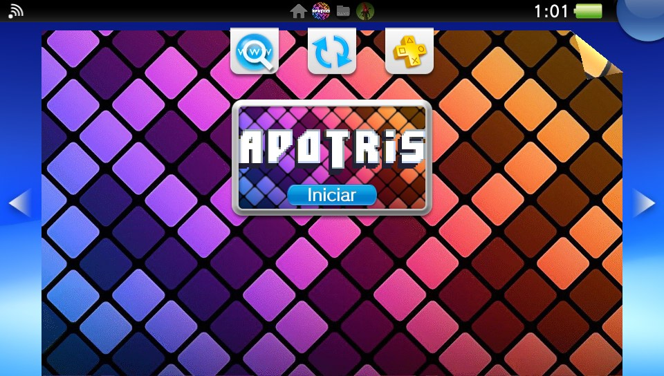
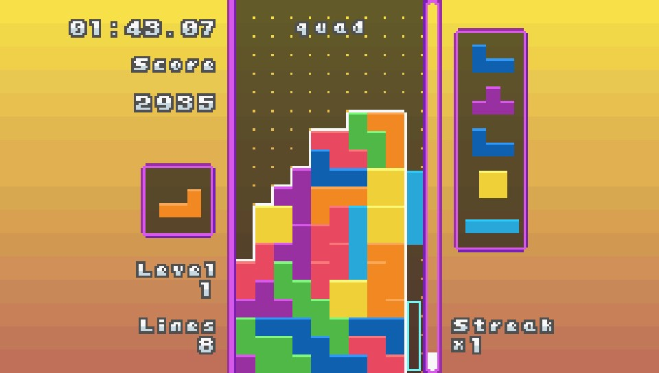
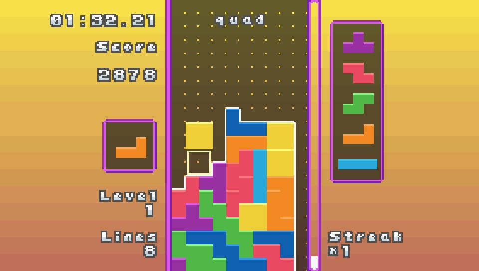
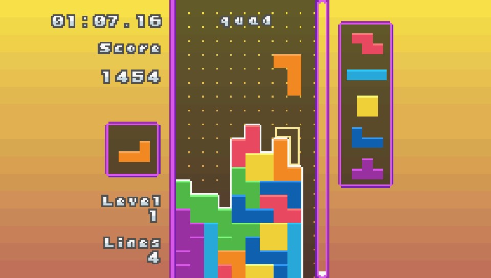
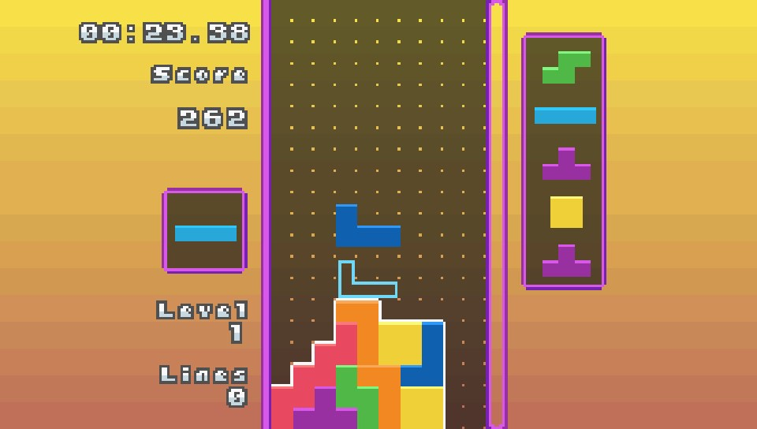
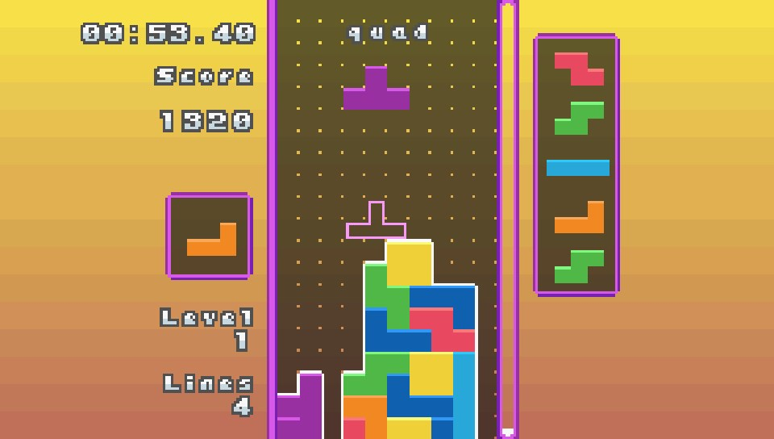

# Apotris - PS Vita Port

**Apotris** is a free multiplatform open-source block stacking game! What sets Apotris apart from other block stacking games is its extensive customization options, complemented by ultra-responsive controls that let you execute your moves with precision. With 14 unique game modes and a plethora of settings, you can tailor the game to your preferences, ensuring a fresh and challenging experience every time you play. Whether you're a casual player or a hardcore enthusiast, Apotris has something for everyone. You can even battle your friends using the Gameboy Advance Link Cable or Wireless Adapters in 2-Player Battle! While Apotris was originally designed for Gameboy Advance, it now supports all kinds of platforms, so between the ports and emulation you can play Apotris on almost anything.

> [!WARNING]
> This port was developed with the assistance of LLMs for coding the open-source apotris game, implementing parts of the codebase. AI was primarily used to assist with crash analysis and certain code implementations. The final result has been manually reviewed and refined.

This is a port of **Apotris** for the *PS Vita*. Tou can read the [original readme](README_ORIGINAL.md)

### v1.0

- Initial release.

## Official Game Download

- [Apotris](https://akouzoukos.com/apotris)

## Setup Instructions For End Users

1.  Install `libshacccg.suprx` to `ur0:/data/` or `ur0:/data/external/`. If you do not have it, follow a [libshacccg extraction guide](https://samilops2.gitbook.io/vita-troubleshooting-guide/shader-compiler/extract-libshacccg.suprx).

2. The game runs correctly at the default 444 MHz CPU clock. For the best performance, however, it's recommended to install [PSVshell](https://github.com/Electry/PSVshell/releases) and overclock the Vita to 500 MHz.

3. Install `apotris.vpk` or downlaod it from vitadb.


## Controls

| Vita input | Action |
| --- | --- |
| D-Pad Left/right | Move|
| D-Pad Up | Hard drop |
| D-Pad Down | Soft drop |
| Cross | Confirm / Rotate piece |
| Circle | Back / Rotate piece |
|  L | Hold / Swap piece |


## Build Instructions For Developers

You need a [VitaSDK](https://github.com/vitasdk) environment built for the soft-float ABI. All native dependencies must also be built with `-mfloat-abi=softfp`; do not mix hard-float and soft-float libraries.

The project expects `VITASDK` to be set, or `CMAKE_TOOLCHAIN_FILE` to point at `vita.toolchain.cmake`.

PowerShell example:

```powershell
$env:VITASDK="C:\vitasdk"
$env:Path="$env:VITASDK\bin;$env:Path"
```

Linux/WSL example:

```bash
export VITASDK=/usr/local/vitasdk
export PATH="$VITASDK/bin:$PATH"
```

Install the Vita-side libraries used by `CMakeLists.txt`:

- SDL2 and SDL2_mixer (use the VitaSDK/vdpm packages, not vanilla SDL2)
- [vitaGL](https://github.com/Rinnegatamante/vitaGL)
- [vitaShaRK](https://github.com/Rinnegatamante/vitaShaRK)
- libpng and zlib
- libopenmpt and mpg123
- OGG and Vorbis, including `vorbisfile`
- kubridge and the VitaSDK system stubs linked by the project

Tilengine and SoLoud are compiled directly from this repository's submodules.
Fetch them before configuring:

```bash
git submodule update --init subprojects/Tilengine subprojects/SoLoud
```
Build a release VPK:

```bash
cmake -S . -B build \
  -DCMAKE_BUILD_TYPE=Release \
  -DCMAKE_TOOLCHAIN_FILE="$VITASDK/share/vita.toolchain.cmake"
cmake --build build --parallel
```

Build with debug symbols and less aggressive optimization:

```bash
cmake -S . -B build-debug \
  -DCMAKE_BUILD_TYPE=Debug \
  -DCMAKE_TOOLCHAIN_FILE="$VITASDK/share/vita.toolchain.cmake"
cmake --build build-debug --parallel
```

---
## Screenshots
 
 
 
 
  



---
## Credits

- lipefipefelps for reminding me this amazing game.
- Dark Bellic for help with assets.
- Rinnegatamante for vitaGL and help with Vita ports.

## License

This software may be modified and distributed under the terms of the AGPL license. See [LICENSE](LICENSE) for details.
